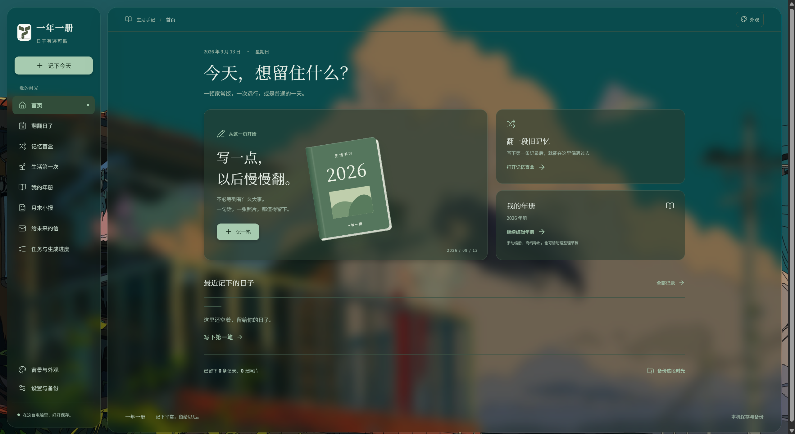
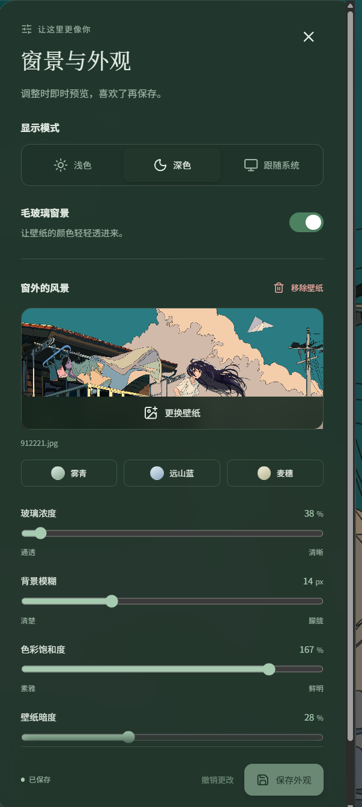
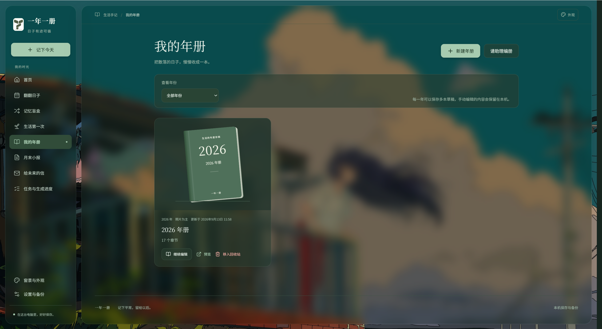
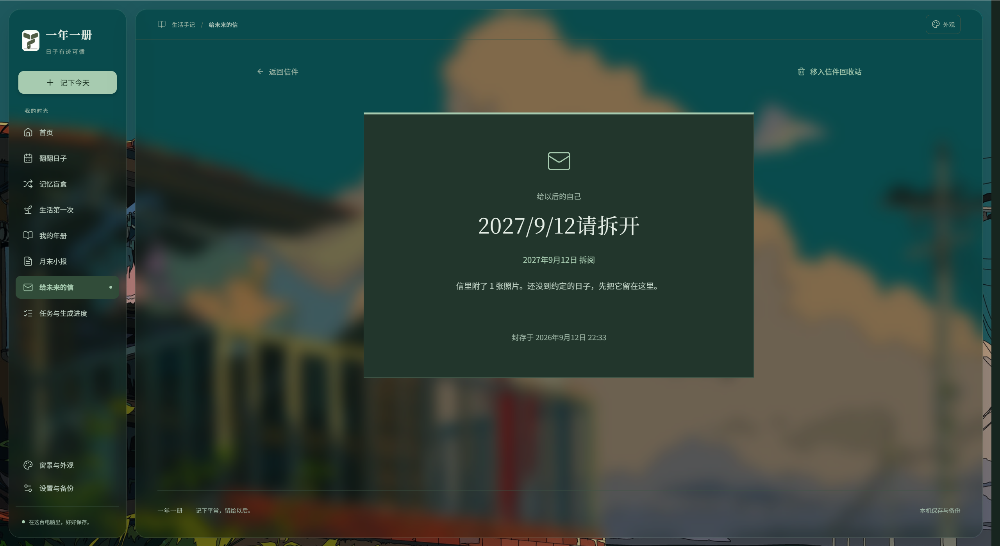

# 一年一册

在 Windows 本机记录文字与照片，通过浏览器回顾生活。

支持文字与照片记录、时间轴/月历、中文搜索、回顾补记、生活第一次、记忆盲盒、给未来的信、备份恢复，以及可完全手动编辑的年册。HTML 和 PDF 使用同一份保存稿与排版，字体、照片均可离线阅读。可选的 AI 助理支持双协议模型配置、单条整理、月报、Agent 和分月编册，生成内容保留来源与版本。



*首页展示，使用自定义壁纸与毛玻璃窗景。*

## 安装与运行

要求 **Node.js 24 LTS，24.14.1 或更高的 24.x**。

下载项目后，在项目目录打开 PowerShell 并运行：

```powershell
npm ci
npm run build
npm start
```

打开终端中显示的地址，默认 `http://127.0.0.1:4317`。端口被占用时会尝试后续 20 个端口，不会终止占用端口的程序。生产服务同时提供网页和接口，首次安装完成后基础功能可离线使用。运行中不要删除依赖、迁移文件和构建目录。

日常使用可以在首次构建后双击 `Start-Yearbook.cmd`：等待服务就绪、打开默认浏览器。重复启动会复用已运行的实例。关闭启动窗口不停止服务；双击 `Stop-Yearbook.cmd` 或运行 `npm run stop` 停止。停止器只通过随机令牌认证停止自己创建的服务，不按进程名批量结束 Node。

在终端运行 `npm start` 或 `npm run dev` 时，在原终端按 `Ctrl+C` 关闭。开发模式使用 Vite 热更新前端，后端改动需重启命令。停止启动器不会关闭另一个终端手动运行的服务。

## 窗景与外观

点击侧栏“窗景与外观”或右上角“外观”，选择浅色、深色或跟随系统。毛玻璃窗景支持三种内置底色，也可以选择或拖入本地 JPEG、PNG、WebP、GIF 图片，调整玻璃浓度、背景模糊、饱和度和壁纸暗度。

调整会即时预览；点击“保存外观”后，下次打开自动恢复。关闭面板或点击“撤销更改”会回到上次保存的外观。“移除壁纸”也需要保存后才会持久生效；关闭毛玻璃开关会切换为纯色界面，并保留壁纸供再次开启。

<p align="center">
  <a href="img/微信图片_20260913175303_1062_11.png">
    
  </a>
</p>

*窗景与外观设置，点击图片可查看原图。*

壁纸保存在当前浏览器的 IndexedDB，外观参数保存在 localStorage，不上传到网络，也不进入资料库备份。更换浏览器、访问端口或清理站点数据后需要重新设置。页面自带浅深色主题，避免 Dark Reader 再次叠加变色。

## 数据与备份

默认数据位于项目下 `data`，不是浏览器缓存。发生日期与录入时间分开；照片导入时复制到本地，原文件移动不影响记录。

| 路径 | 内容 |
|---|---|
| `data/yearbook.sqlite3` | 记录、关联、人物、标签、回顾、未来信/照片关联、年册/版本、模型配置引用、AI 草稿/来源/阶段、任务、迁移和盲盒历史 |
| `data/media` | 哈希去重后的原图 |
| `data/display`、`data/thumbnails` | 方向规范化阅读图及缩略图 |
| `data/backups` | 可下载的备份 ZIP，包含恢复前备份 |
| `data/exports` | 离线年册 ZIP、PDF 等导出产物 |
| `data/tmp` | 受控临时目录，通常由任务自行清理 |
| `.runtime` | 启动器状态与日志；不进入备份或 Git |

在“设置与备份”创建备份，再下载 ZIP 到另一块磁盘。恢复前先校验清单、文件哈希、数据库结构和关联，再自动创建当前资料的恢复前备份；替换失败会回滚。恢复中退出后，下次启动会保守回滚至恢复前资料。ZIP 不包含历史备份、临时导出、运行日志或密钥。

备份支持从旧迁移版本验证后升级。备份不携带可复用的模型凭据引用；恢复后需重新填写 Key 并验证能力，无 Key 的本机服务只需重新验证。恢复前生成的原库备份同样排除密钥。不要手动改动备份的清单或数据库。

内置限制：照片每张 25 MB、一次 100 张；备份 ZIP 512 MB、解压内容 1 GB、约 8,333 张照片。超限时停止应用后完整复制 `data` 到其他磁盘；不要在服务运行时仅复制 SQLite 主文件，WAL 中可能仍有数据。当前并未实现自动清理未关联原图，以保护共享引用。

可通过环境变量指定数据位置或起始端口，支持中文和空格：

```powershell
$env:YEARBOOK_DATA_DIR = 'D:\我的资料\一年一册 数据'
$env:YEARBOOK_PORT = '4417'
npm start
```

同一数据目录一次只允许一个服务进程。不要同时用两个启动方式打开同一目录。浏览器未提交表单会尽量存入本机 localStorage；清除浏览器站点数据会删除这些草稿，已保存的记录不受影响。

`img` 存放项目标志与文档截图，不属于记录资料。应用不会自动生成演示记录。

## AI 整理与手工编册

“设置与备份”可以配置 Responses 或 Chat Completions 兼容服务，分别验证文本、图片、工具及流式能力。Key 优先存 Windows 系统凭据；不可用时可选择仅本次服务会话使用。API Key 仅在应用设置页填写。详细地址示例、协议限制和错误说明见 [AI 配置](docs/AI_CONFIGURATION.md)。

记录详情可建议标题、整理文字或提出补充问题；“月末小报”和年册编辑页可整理选定素材。AI 内容保存为独立草稿，生成不会改动原记录；用户编辑、采用后才进入记录编辑页或年册。重新生成保留旧稿，采用整册前保留原年册版本。没有工具能力时退回程序筛选素材的固定流程，图片能力缺失时使用用户图注。进度、来源、实际用量、取消与继续/重试都在任务/草稿页查看。

侧栏“任务与生成进度”可将任务移入回收站，并在“回收站”页签恢复。等待中或运行中的任务移入时会取消；已完成的阶段、草稿和导出结果仍保留。恢复只将任务放回列表，需要继续的任务由你手动重试。

不配置任何模型也能制作年册。同一年可以新建多本，编辑开篇、章节、原话、图片和记录卡片；用上移、下移调整章节与内容块。年度照片选集可以按勾选顺序批量添加，再调整照片顺序及说明；移动不会丢失来源。可选“照片为主”或“文字为主”，分别突出大幅照片或正文阅读。



*我的年册：按年份查看已保存的年册，继续编辑或打开阅读预览。*

有未保存修改时，使用“保存并预览”“保存并导出”完成保存后继续。预览与导出使用同一份排版；“打印年册”打印预览文档，不会把侧栏或编辑按钮印进年册。保存历史可以从编辑页恢复。

阅读预览提供章节目录、适合宽度、50%–150% 缩放和专注阅读；按 Esc 退出专注。目录只滚动年册内部，阅读进度会随位置和缩放更新。照片预览支持左右方向键切换，Esc 关闭。

年册采用独立的浅色纸面排版，包含年度封面、可点击目录、章节编号和页码，PDF 还带有章节书签。“照片为主”保留大幅画面，“文字为主”收紧图片、突出正文。界面壁纸、深色模式和预览缩放都不会进入打印或导出的文件。

“离线 HTML”导出 ZIP，解压后打开 `index.html`。样式、照片和本次内容所需的 Noto 中文字体已嵌入，ZIP 另含字体许可证和导出版本清单。“PDF 导出”由本机 Edge/Chrome/Chromium 在独立临时配置中排版，等待字体和照片载入后生成 A4 PDF；正常浏览器窗口不受影响。需要指定浏览器时，在启动前设置 `YEARBOOK_BROWSER` 为可执行文件绝对路径，例如 `C:\Program Files (x86)\Microsoft\Edge\Application\msedge.exe`。导出进度、取消、错误和重试均可在任务页查看。

## 给未来的信

打开“给未来的信”写正文、附照片、选择查看日期。可以先“保存草稿”，关掉应用后再写；未提交编辑也会尽量保留在当前浏览器。封存前会再次展示查看日期，确认后正文、照片和日期不能修改。

查看日期按这台电脑的本地日历判断。未到期只显示信封；到期后首页提示，点击“拆开这封信”才记录首次阅读时间。程序关闭期间不运行通知计时器，下次启动或访问时检查。误删的信可从信件回收站恢复，原日期与照片关系保留。



*封存后的信件在约定日期前只显示信封，正文与照片暂不展开。*

信件独立于普通记录，时间轴、盲盒和 AI 工具不会检索它。只属于未到期信件的照片也受读取限制；已被其他记录或年册引用的共享照片仍可使用。封存是应用内的查看日期限制，数据库和备份仍保存原文，应像其他个人资料一样保管本机文件与备份。

## 开发与测试

在项目目录运行：

```powershell
npm run dev
npm run typecheck
npm test
npm run test:e2e
```

`npm run dev` 启动开发服务，`npm run typecheck` 检查类型，`npm test` 运行自动化测试。`npm run test:e2e` 需要本机安装 Tabbit；PDF 相关测试需要 Chrome 或 Edge。测试使用独立的临时资料目录，模型测试使用本机模拟服务。

`node scripts/verify-runtime.mjs` 用于验证 Windows 启停、端口冲突及中文空格路径，`--use-existing-build` 可复用当前构建。`npx tsx tests/export-evidence.ts` 生成排版测试用年册及 HTML/PDF，输出位于 `test-results`。

## 故障处理

- 启动器错误查看 `.runtime/server.log`。首次运行找不到构建，请执行 `npm ci`、`npm run build`。
- 模型生成失败查看“任务与生成进度”，已完成阶段会保留；检查配置后继续/重试。取消会中断请求。关闭服务后未完成任务在下次启动标为可重试，不自动发送资料。
- 模型连接或生成失败时，检查服务地址、协议、模型名和密钥，并在“设置与备份”逐项验证能力。部分兼容服务只开放指定客户端，需确认服务支持第三方应用调用。
- 若意外断电留下无法读取的 `.runtime/launcher.lock`，确认所有启动窗口已关闭后删除这个锁文件即可；不要删除 `data`。`data/.instance-lock` 在旧进程已退出且信息有效时会自动回收，若损坏应先确认应用已停止再检查。

其他说明：[架构](docs/ARCHITECTURE.md) · [接口文档](docs/CONTRACT.md) · [AI 配置](docs/AI_CONFIGURATION.md)。
